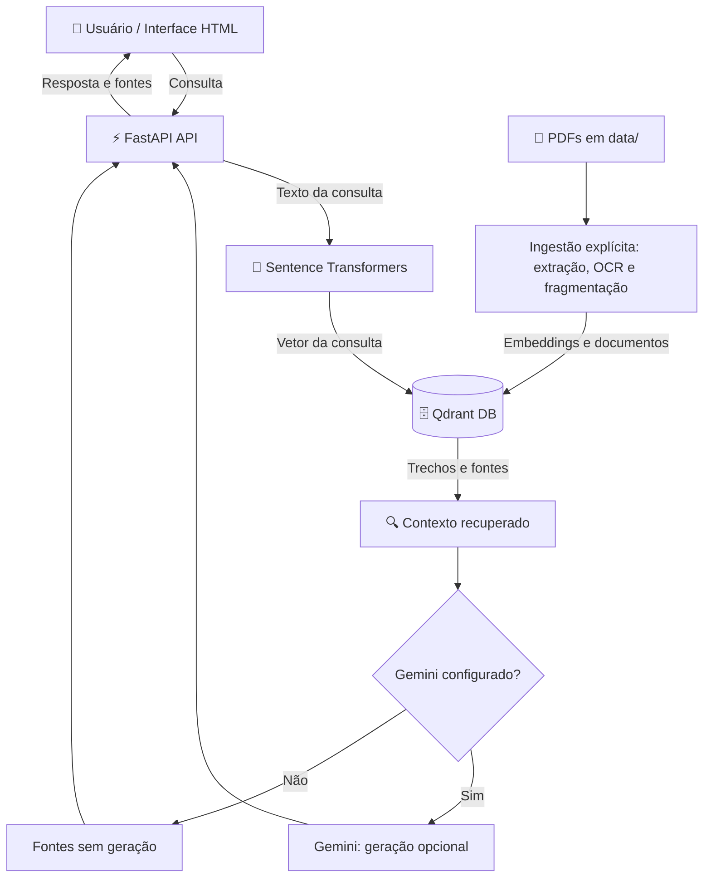

# ⚖️ Juribot — Assistente Jurídico com RAG e Busca Semântica


**Tecnologias:** `Python` · `FastAPI` · `Sentence Transformers` · `PyTorch CPU` · `Qdrant` · `Gemini (opcional)` · `Docker Compose` · `HTML/JavaScript` · `GitHub Actions`

Assistente jurídico experimental com FastAPI, interface HTML, busca semântica em PDFs no Qdrant e geração opcional pelo Gemini. O escopo atual de estabilização é a API e `backend/ui/index.html`. O Next.js permanece em `frontend/`, fora da inicialização padrão.

**Navegação:** [Tecnologias](#tecnologias) · [Arquitetura](#arquitetura) · [Docker](#docker) · [Configuração e segurança](#configuracao) · [Dados e prontidão](#dados) · [Python local](#python-local) · [Estrutura](#estrutura) · [Testes e CI](#testes)

---

<a id="tecnologias"></a>
## 🛠️ Tecnologias e ferramentas

| Componente | Tecnologia | Função no sistema |
| :--- | :--- | :--- |
| **API web** | Python 3.11 / FastAPI 0.111.0 | Recebimento de consultas, classificação, busca e chat |
| **Embeddings** | Sentence Transformers / PyTorch CPU | Representação semântica dos textos e das consultas |
| **Banco vetorial** | Qdrant 1.9.2 | Armazenamento de vetores e recuperação por similaridade |
| **Geração RAG** | Gemini, opcional | Geração de respostas usando o contexto recuperado |
| **Documentos e OCR** | pdfplumber / Poppler / Tesseract | Extração de texto dos PDFs e reconhecimento óptico |
| **Interface principal** | HTML / JavaScript | Consultas e apresentação segura das respostas e fontes |
| **Execução** | Docker / Docker Compose | API, banco e serviços na rede interna |
| **Automação** | unittest / jsdom / GitHub Actions | Testes da API e da interface, build e verificações de CI |
| **Componentes preservados** | Redis / Next.js | Redis na composição; Next.js em perfil opcional, fora do escopo estabilizado |

<a id="arquitetura"></a>
## 🏗️ Arquitetura do sistema



O diagrama representa o fluxo de busca com RAG. O roteador também pode selecionar resposta direta, sem recuperação, conforme a pergunta ou o rótulo informado. A ingestão usa o mesmo modelo de embeddings da API e é executada separadamente.

---

<a id="docker"></a>
## 🐳 Execução com Docker

Requisitos: Docker Engine/Desktop em execução e Docker Compose 2.24 ou superior. Execute na raiz do repositório:

```sh
docker compose -f ops/docker-compose.yml config --quiet
docker compose -f ops/docker-compose.yml build api
docker compose -f ops/docker-compose.yml up -d
```

Abra <http://127.0.0.1:8000/ui/>. Documentação da API: <http://127.0.0.1:8000/docs>. A API publica apenas em loopback; Qdrant e Redis ficam na rede do Compose.

O primeiro início baixa o modelo de embeddings e pode demorar; exige acesso à internet e espaço para o cache. A imagem padrão usa PyTorch para CPU. Modelos são carregados no ciclo de vida da API, sem downloads ao importar módulos. Uma falha de carregamento deixa a aplicação sem prontidão; após resolver a causa, reinicie a API.

```sh
docker compose -f ops/docker-compose.yml logs -f api
docker compose -f ops/docker-compose.yml restart api
```

<a id="configuracao"></a>
## 🔐 Variáveis de ambiente e segurança

O arquivo `.env` é opcional. Para personalizar, copie [`.env.example`](.env.example) para `.env` e ajuste os valores localmente. Nunca versione credenciais. Sem `GEMINI_API_KEY`, busca, classificação e interface continuam disponíveis; o chat retorna fontes sem geração. Para gerar respostas, configure também `GEMINI_MODEL` com um modelo disponível na sua conta. Não há chamada paga no teste de prontidão.

| Configuração | Finalidade |
| :--- | :--- |
| `GEMINI_API_KEY` / `GEMINI_MODEL` | Habilitar a geração opcional; a chave deve permanecer local |
| `EMBEDDING_MODEL` / `EMBEDDING_DEVICE` | Modelo compartilhado pela busca e ingestão; CPU por padrão |
| `EMBEDDING_REVISION` | Commit imutável de 40 caracteres do modelo no Hugging Face, compartilhado pela ingestão e consulta |
| `EMBEDDING_BATCH_SIZE` / `QDRANT_BATCH_SIZE` | Limites dos lotes de vetorização e gravação |
| `DOCUMENT_NAMESPACE` | Identidade do conjunto documental; mantenha estável entre execuções |
| `DATA_DIR` / `POPPLER_PATH` | Documentos e localização opcional dos binários Poppler |
| `QDRANT_HOST` / `QDRANT_URL` / `QDRANT_COLLECTION` | Endereço e coleção do banco vetorial |
| `QDRANT_TIMEOUT` / `READINESS_TIMEOUT` | Limites de espera para operações e prontidão |

A API fica restrita ao host local, e Qdrant e Redis não publicam portas no host. O CORS aceita apenas as origens locais explícitas. A interface apresenta o conteúdo da IA como texto e rejeita links de fontes com protocolos perigosos. As regras de Git e dos contextos de build excluem segredos; `.env.example` contém apenas valores de exemplo sem credenciais.

<a id="dados"></a>
## 📚 Dados e prontidão

- `GET /health`: processo respondendo, independentemente do banco ou dos modelos.
- `GET /ready`: 200 quando embeddings, Qdrant e coleção estão disponíveis e compatíveis; 503 enquanto houver dependência indisponível, coleção ausente/vazia ou configuração Gemini incompleta.
- `POST /search`, `POST /chat` e `POST /classify`: consulte os contratos em `/docs`.

Uma instalação sem índice retorna 503 em `/ready`. Para indexar PDFs existentes em `data/`, execute explicitamente:

```sh
docker compose -f ops/docker-compose.yml exec api python -m backend.ingest.prepare_index --collection juribot_chunks_v2
```

A ingestão escreve apenas na coleção explicitamente indicada. O comando acima cria uma coleção nova; a antiga `juribot_chunks` fica protegida. Coleções existentes sem o manifesto de embeddings, ou com modelo, revisão, dimensão ou métrica diferentes, são recusadas. Não há exclusão/recriação automática de coleções. Use outro nome se `juribot_chunks_v2` já pertencer a um índice incompatível.

Ingestão e consulta usam o mesmo modelo e revisão fixada, normalização explícita e dimensão obtida do modelo carregado. A API verifica o manifesto antes de consultar, e `/ready` exige documentos publicados, além da compatibilidade. A revisão padrão está fixada em `1110a243fdf4706b3f48f1d95db1a4f5529b4d41`. Ao trocar o modelo, configure também o commit correto do novo repositório e construa outra coleção.

Para validar uma amostra antes da indexação completa, acrescente `--file "caminho/relativo.pdf"` (repetível) ou `--limit 1`. `--no-ocr` usa apenas o texto incorporado no PDF. Depois de validar a nova coleção, altere **explicitamente** `QDRANT_COLLECTION` no `.env` da API e recrie somente a API com `docker compose -f ops/docker-compose.yml up -d --no-deps api`. A seleção da coleção antiga permanece inalterada até essa ação; índices antigos sem manifesto aparecerão como incompatíveis em `/ready`.

Cada documento tem identidade derivada de `DOCUMENT_NAMESPACE` e do caminho relativo a `DATA_DIR`, independente da máquina e da página. A versão considera o hash do PDF, texto extraído, títulos e configuração de fragmentação. Repetir a ingestão mantém os mesmos IDs. Após gravar todos os lotes, um registro publica a nova versão e a limpeza remove apenas os trechos obsoletos desse documento. Falhas anteriores à publicação mantêm a versão anterior consultável; uma nova execução conclui a atualização. Os registros de controle não aparecem nas buscas.

Extração ou OCR malsucedidos rejeitam o documento inteiro e são relatados; páginas sem texto também são tratadas como falha para evitar substituir um documento por uma extração parcial. Se algum documento falhar, ou nenhum for indexado, o comando encerra com código 1. Documentos que concluíram antes de outra falha permanecem publicados. PDFs removidos ou renomeados não são excluídos automaticamente do índice.

Execute **um único processo de ingestão por coleção**. Há trava local por host, mas não uma trava distribuída entre máquinas/containers. A publicação é por documento, não uma transação para o corpus inteiro; uma consulta concorrente à troca de versão pode precisar ser repetida. A consulta lê os registros de versões publicadas; essa abordagem é destinada ao corpus atual e exigirá outra estratégia de filtragem em escala maior. O processo de ingestão não faz parte da inicialização automática.

PDFs são montados em `/app/data`; os volumes `qdrant_data`, `redis_data` e `embedding_cache` persistem. Não use `down --volumes` para interromper o projeto. Antes de iniciar sobre uma instalação existente, mantenha o nome de projeto Compose usado anteriormente: ele determina quais volumes serão associados. O padrão agora é `juribot`; use `-p NOME_EXISTENTE` em todos os comandos se necessário, sem apagar volumes.

<a id="python-local"></a>
## 🐍 Execução Python local

Ambiente validado: Python 3.11. Crie um ambiente virtual e instale:

```sh
python -m venv .venv
# Ative .venv conforme seu sistema operacional.
python -m pip install torch==2.10.0 --index-url https://download.pytorch.org/whl/cpu
python -m pip install -r backend/requirements.txt
python -m uvicorn backend.app_main:app --host 127.0.0.1 --port 8000
```

Instale Poppler e Tesseract com idioma português para OCR local. No Windows, `POPPLER_PATH` pode apontar para os binários. Os caminhos relativos de `DATA_DIR` são resolvidos a partir da raiz do projeto, e a configuração lê o `.env` dessa raiz.

A API local precisa de Qdrant acessível no endereço configurado. O Compose padrão não publica o banco no host; prefira executar a API pelo Compose ou configurar um banco local separado. Dentro do Compose, `QDRANT_HOST=qdrant` é definido automaticamente. Um `QDRANT_URL` explícito tem precedência.

<a id="estrutura"></a>
## 🗂️ Estrutura

| Caminho | Responsabilidade |
| --- | --- |
| `backend/app_main.py` | Aplicação, ciclo de vida, rotas e saúde |
| `backend/core/config.py` | Configuração única e validação |
| `backend/core/runtime.py` | Recursos, busca e prontidão |
| `backend/api/` | Chat e classificação |
| `backend/rag/` | Embeddings e componentes de recuperação |
| `backend/ingest/` | Extração, fragmentação e indexação |
| `backend/ui/` | Interface HTML principal |
| `backend/tests/` | Testes de inicialização e segurança |
| `frontend/` | Next.js opcional, ainda fora do escopo estabilizado |
| `ops/docker-compose.yml` | Serviços e volumes |
| `data/` | Documentos locais |
| `.github/workflows/ci.yml` | Testes e build automatizados |

<a id="testes"></a>
## 🧪 Testes e CI

```sh
python -m pip install -r backend/requirements-test.txt
python -B -m unittest discover -s backend/tests -p "test_*.py" -v
```

Os testes de configuração também exigem Git e Docker Compose recente com `--no-env-resolution`. Consulte [os testes da interface](backend/tests/README.md) para executar as verificações DOM. A CI executa testes Python, segurança da interface, validação Compose, build, `pip check` e imports sem rede ou credenciais.

Com GNU Make instalado, `make config`, `make build`, `make up`, `make logs`, `make ingest` e `make test` usam os caminhos corretos. `make ingest` tem como destino `juribot_chunks_v2`; use `INGEST_COLLECTION=OUTRO_NOME` para escolher outra coleção. Para uma instalação anterior com outro nome de projeto, passe `COMPOSE_PROJECT_NAME=NOME_EXISTENTE`.

O perfil `--profile frontend` permite iniciar o Next.js explicitamente; seus arquivos foram preservados, mas esse fluxo ainda não foi estabilizado. Redis permanece na composição, embora não seja uma dependência da busca atual. O SDK Gemini legado e a qualidade/validação factual das respostas ainda precisam de revisão própria.
